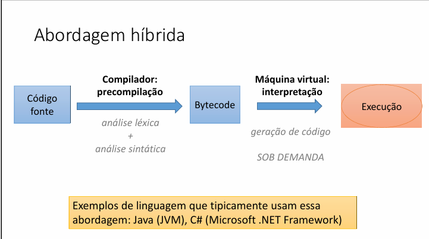
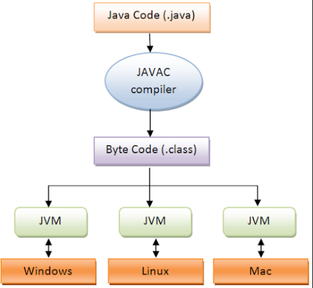

# Abordagem Híbrida (Java)

## Primeira parte - Compilação
**1**. O código-fonte (geralmente com a extensão .java).

**2**. O compilador: o Java usa um programa esppecial chamado **compilador**(javac). Ele pega o código-fonte e o traduz para uma linguagem intermediária chamada Bytecode.

**3** .O Bytecode: é um código "meio-termo", que não é a linguagem de programação e nem a linguagem finaç do computador.( ele tem a extensão .class).

**Por que fazer isso?** o bytecode é a chave para a portabilide do Java. Ele é igual em qualque computador. Não importa se você está no Windows, Mac ou Linux, o Bytecode é o mesmo.

## Segunda parte - Interpretação
A parte que executamos o bytecode

**1**. Máquina Virtual Java(JVM): é um programa que você precisa instalar em cada computador. Ela funciona como um tradutor exclusivo para o bytecode.

**2.** A Execução Hibrida: Quando você roda seu programa, a JVM lê o bytecode e o traduz, linha por linha, para a linguagem nativa daquele computador (seja Windows, Mac ou Linux).

Como o Bytecode já está "meio-pronto" (foi compilado antes), esse processo é muito mais rápido do que traduzir o código-fonte original linha por linha.

### Conceito de portabilidade
No contexto de software, portabilidade é a capacidade que um programa tem de ser executado em diferentes ambientes de computador (sistemas operacionais ou arquiteturas de hardware) com pouca ou nenhuma modificação no código.

**A Magia do "Escreva uma vez, rode em qualquer lugar"**
 
 O programador, só precisa escrever o código-fonte uma única vez (os arquivos .java).

A Ponte Universal (Bytecode): Você compila esse código-fonte para o formato intermediário universal, o Bytecode. Esse Bytecode é a sua versão padrão do programa, que é a mesma para todos os sistemas.

"Rode em qualquer lugar": O Bytecode não precisa ser modificado. Ele é entregue a qualquer computador que tenha a JVM instalada. A JVM é o "tradutor mágico" que sabe como pegar o Bytecode e fazê-lo funcionar naquele sistema operacional específico.

Em resumo: Seu programa Java conversa apenas com a JVM, e a JVM se encarrega de conversar com o sistema operacional (Windows, Mac, etc.) de maneira nativa. Isso garante que o seu código-fonte seja portável e funcione onde a JVM estiver.

