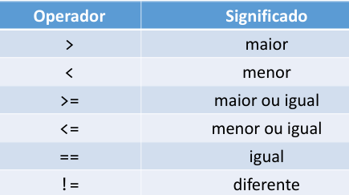
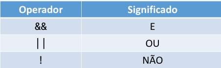
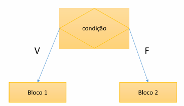
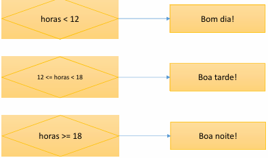
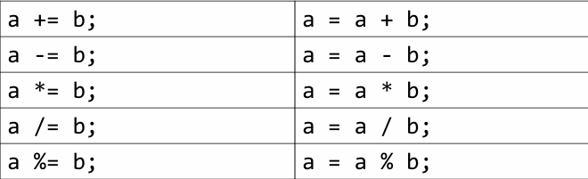

## Expressões comparativas
São expressões que comparam uma coisa com outra e o resultado dela dão um **valor verdade**

`valor verdade = verdadeiro ou falso`



## Expressões lógica
Também dão o resultado um **valor verdade**



## Estrutura condicional
**Conceito:**
é uma estrutura de controle(direciona o fluxo do programa) que permite definir que um certo **bloco de comando** somente será executado dependendo de uma condição.



Temos dois tipos de estrutura condicionais
### Condicional simples
sintaxe

```java
if(condição>){
    <comando1>
    <comando2>
}
```
Regra:
Se for verdadeira: executa o bloco de comando
Se for falso: pula o bloco de comandos
### Condicional composta
sintaxe
```java
if(<condição>){
    <comando1>
    <comando2>
}
else{
    <comando3>
    <comando4>
}
```
Regra:
Se for verdadeira: executa o bloco do **if**
Se for falso: executa o bloco do **else**

### E se tiver mais de duas possibilidade



É utilizado o encadeamento de estruturas condicionais

# Sintaxes opcionais
Operadores de atribuição cumulativa



# Estrutura switch-case
sintaxe
```java
switch( expressão ){
case valor1:
     comando1
     comando2
     break
case valor2:
     comando3
     comando4
     break
default:
    comando5
    comando6
    break;
} 
```
# Expressão condicional ternária
É uma estrutura opcional ao if-else 

Sintaxe:
```java
(condição) ? valor_se_verdadeiro : valor_se_falso