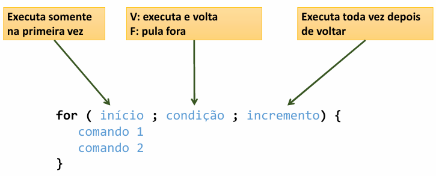

# Estrutura "enquanto"(while)
É uma estrutura de controle que repete um bloco de comandos enquanto uma condição for verdadeira

**Quando usar:** quando **não** se sabe previamente a quantidade de repetições que será realizada.

sintaxe
```java
while( condição ){
    comando1
    comando2
}
```
# Estrutura repetitiva "para' (for)

É uma estrutura de controle que repete um bloco de comandos para um intervalo específico.

**Quando usar:** quando se sabe previamente a quantidade de repetições, ou o intervalo de valores.
sintaxe


# Estrutura repetitiva "faça-enquanto" (do-while)
Essa estrutura executa pelo menos uma vez, pois a condição é verificada no final.

sintaxe
```java
do {
    comando1
    comando2
} while( condição );