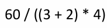
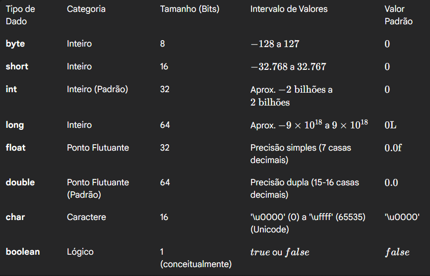
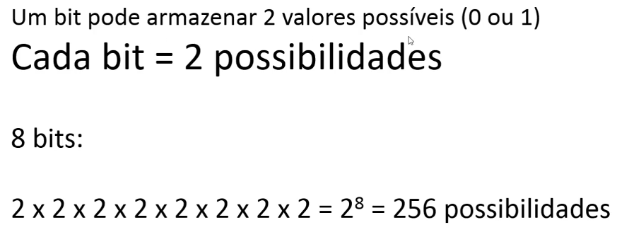

### Operadores aritméticos

% - mod(resto da divisão)

Ordem de execução:
1. * / %
2. + -

Obs: em linguagem de programação, para interferir na ordem de execução não utilizamos chaves e colchetes, apenas parênteses.

### Variáveis

Uma variável possui:
- Nome
- Tipo
- Valor
- Endereço( indica onde a variável está armazenada)

**Tipos primitivos em Java**

Explicação sobre o tamanho dos tipos primitivos

X bits - significa o número de valores possíveis que uma variável desse tipo pode armazenar.

Então teremos no exemplo 256 possibilidades, só que na linguagem Java, temos valores positivos e negativos,com isso: dentro daquelas 256 possibilidades, metade tem que ser positivo e metade negativo.

Cada tipo primitivo, depende do contexto, se sabemos que o valor não vai passar exemplo de: ( -128 a 127), o mais recomendado é utilizar o byte.