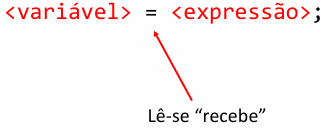
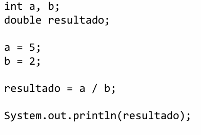
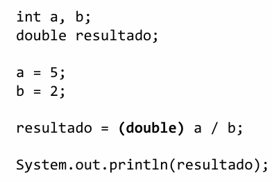
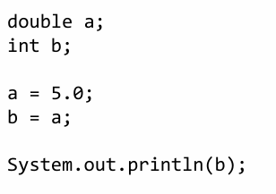
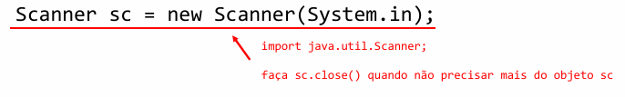
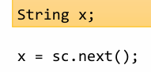
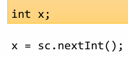
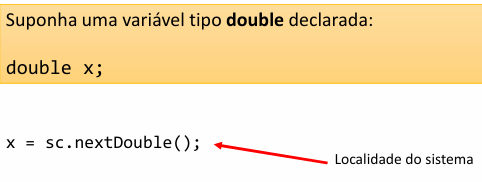
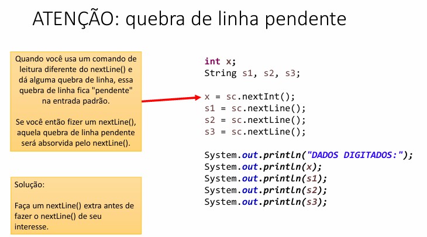

# Processamento de dados

É realizado através do comando de atribuição
**Sintaxe**


A expressão é calculada
O resultado da expressão é armazenado na variável

Boa prática:
Sempre indique o tipo do número, se a expressão for de ponto flutuante(não inteira).

Para double use:
.0

b = 6.0;

Para float use:
f

## Casting
É a conversão explicíta dos valores.

É necessário quando o compilador não é capaz de "adivinhar" que o resultado de uma expressão deve ser de outro tipo.





E também utilizamos quando não nos importamos em perder dados.



# Entrada de dados ou Leitura
Quando o usuário informas dados ao programa(através de dispositivos de entrada) e é armazenado em variáveis.

Para fazer entrada de dados em Java, precisamos criar um objeto do tipo "Scanner" da seguinte forma:

System.in - associa o objeto scanner ao teclado.


Para ler uma palavra(texto sem espaços)



Para ler um número inteiro


Para ler um número com ponto flutuante



### Comando
Caso queira que o separador de decimais seja ponto, ANTES da declaração do Scanner,faça:

```java
Locale.setDefault(Locale.US);
```

Normalmente as máquinas estão configuradas com português do Brasil, utilizando a vírgula.


Para ler  um caractere

.charAt(0) - le o primeiro caractere mesmo que escreva uma palavra.

Para ler um texto até a quebra de linha(Enter)

nextLine();

